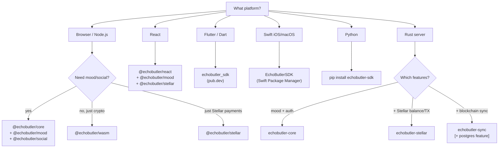

# Architecture

EchoButler SDK is a multi-language, multi-platform SDK built on a shared Rust core. This page shows exactly how the pieces fit together — which crates depend on which, how compiled artifacts cross language boundaries, and which package you need for a given use case.

## Dependency graph

The diagram below is derived directly from the `Cargo.toml` and `package.json` dependency declarations in this monorepo.

```mermaid
flowchart TD
    subgraph rust ["Rust Crates"]
        core["echobutler-core\n─────────────────\ntypes · HTTP client\nauth · config · errors"]
        stellar["echobutler-stellar\n─────────────────\nHorizon client · balances\nFriendbot · TX building"]
        sync["echobutler-sync\n─────────────────\nSSE streaming · resumable\ncursors · gap backfill\n[postgres feature: sqlx]"]
        ffi["echobutler-ffi\n─────────────────\nC-ABI  .so/.dylib/.dll\ncdylib + staticlib"]
        wasm["echobutler-wasm\n─────────────────\nWebAssembly  cdylib+rlib\ncrypto · hashing · XDR\nwasm-bindgen"]
        python["echobutler-python\n─────────────────\nPyO3 native extension\ncdylib · asyncio support"]
    end

    subgraph jslayer ["JavaScript / TypeScript"]
        jscore["@echobutler/core\n─────────────────\nAPI client · auth\nshared TS types"]
        mood["@echobutler/mood\n─────────────────\nmood logging · streaks\nAI reflections"]
        jsstellar["@echobutler/stellar\n─────────────────\nFreighter · Albedo\nXLM/ECHO balance · send"]
        react["@echobutler/react\n─────────────────\nProvider · hooks\ncontext"]
        social["@echobutler/social\n─────────────────\nfeed · leaderboard\nfollows"]
        analytics["@echobutler/analytics\n─────────────────\nemotion UX events\nprivacy-safe · standalone"]
        wasmjs["@echobutler/wasm\n─────────────────\nTS wrapper around\nwasm-bindgen output"]
    end

    subgraph native ["Native Packages"]
        flutter["echobutler_sdk\n(Flutter / Dart)\n─────────────────\nffi · http\nshared_preferences"]
        pylib["echobutler-python\n(pip install echobutler-sdk)\n─────────────────\nasync Python client"]
        swift["EchoButlerSDK\n(Swift / SPM)\n─────────────────\niOS 15+ · macOS 12+"]
    end

    %% Rust internal dependencies
    stellar --> core
    sync --> core
    sync --> stellar
    ffi --> core
    ffi --> stellar
    python --> core
    python --> stellar

    %% Rust → compiled artifacts → language bindings
    wasm -- "wasm-pack → wasm-bindgen" --> wasmjs
    ffi -- "dart:ffi" --> flutter
    ffi -- "Swift FFI\n(EchoButlerFFI.xcframework)" --> swift
    python -- "maturin build" --> pylib

    %% JS internal dependencies
    mood --> jscore
    jsstellar --> jscore
    react --> jscore
    social --> jscore
```



### Key observations

**`echobutler-wasm` is independent of the other crates.** It uses `wasm-bindgen` directly and implements its own crypto (sha2, hex). It is the WASM build target — not a wrapper around `echobutler-core`.

**`@echobutler/core` is a pure TypeScript package.** It is a REST API client for the EchoButler backend, not a wrapper around `@echobutler/wasm`. The two serve different purposes: `/core` handles mood, auth, and social API calls; `/wasm` exposes cryptographic utilities (address validation, hashing) that run entirely in the browser without an API call.

**`@echobutler/analytics` is standalone.** It has no dependency on other `@echobutler/*` packages and can be dropped into any existing app without pulling in the rest of the SDK.

**Three distinct FFI surfaces.** The Rust codebase produces three compiled artifacts for non-Rust callers:

| Artifact | Output type | Consumed by |
|---|---|---|
| `echobutler-wasm` | `.wasm` via wasm-pack | `@echobutler/wasm` (JS/TS) |
| `echobutler-ffi` `.so/.dylib/.dll` | cdylib + staticlib | Flutter (`dart:ffi`), Swift (`xcframework`) |
| `echobutler-ffi` `.a` / `.xcframework` | staticlib | Swift SPM binary target |
| `echobutler-python` `_echobutler.so` | cdylib (PyO3) | Python (`echobutler` package) |

---

## Which package do I need?

Use this table to find the right starting point. Most use cases need only one or two packages.

### I'm building a **web app** (browser)

| Goal | Install |
|---|---|
| Log moods, get streaks, AI reflections | `@echobutler/core` + `@echobutler/mood` |
| Add Stellar wallet + ECHO balance | `@echobutler/stellar` |
| React hooks and Provider | `@echobutler/react` (includes `@echobutler/core`) |
| Drop-in floating mood widget | `@echobutler/widget` |
| Raw crypto utilities (address validation, hashing) with no backend call | `@echobutler/wasm` |
| Track emotional UX events | `@echobutler/analytics` (standalone, no SDK needed) |
| Social feed, leaderboard, follows | `@echobutler/social` |

**Typical React app** → `@echobutler/react` + `@echobutler/mood` + `@echobutler/stellar`

### I'm building a **React Native / Expo** app

Use the JS packages above. The `@echobutler/wasm` package works in React Native with Metro's WASM support. For native crypto performance, you can also use `echobutler-ffi` via a native module.

### I'm building a **Flutter / Dart** app

Install `echobutler_sdk` from pub.dev. The Flutter package already bundles the FFI bridge to `echobutler-ffi` — you do not need to add the Rust crates separately.

```yaml
dependencies:
  echobutler_sdk: ^0.1.0
```

### I'm building an **iOS or macOS** app in Swift

Add `packages/swift/EchoButlerSDK` as a Swift Package Manager local dependency, or wait for the SPM registry release. Build the XCFramework first:

```bash
packages/swift/EchoButlerSDK/Scripts/build-xcframework.sh
```

### I'm building a **Python** backend

```bash
pip install echobutler-sdk
```

This installs the PyO3 native extension (`echobutler-python`) with full asyncio support.

### I'm building a **Rust** backend / server

Add whichever crates you need:

```toml
[dependencies]
echobutler-core = "0.1"       # always needed: client, types, auth
echobutler-stellar = "0.1"    # Stellar balance, Friendbot, TX building
echobutler-sync = "0.1"       # streaming ledger sync with resumable cursors
```

Add the `postgres` feature to `echobutler-sync` if you want the built-in cursor store:

```toml
echobutler-sync = { version = "0.1", features = ["postgres"] }
```

### I need **Stellar payments only** (no mood, no social)

- **TypeScript/JS** → `@echobutler/stellar` alone (it depends on `@echobutler/core` but that's a lightweight API client)
- **Rust** → `echobutler-stellar` + `echobutler-core`
- **Flutter** → `echobutler_sdk` (the Flutter package is unified; you only call the stellar APIs)
- **Python** → `pip install echobutler-sdk` then use `sdk.stellar.*`

### I need **address validation or hashing** with no backend

Use `@echobutler/wasm` directly. It runs entirely in the browser (or Node.js) — no API key, no backend call:

```ts
import { isValidStellarAddress, hashPublicKey } from '@echobutler/wasm'
console.log(isValidStellarAddress('GPUBLIC_KEY')) // true
console.log(hashPublicKey('GPUBLIC_KEY'))          // sha256 hex
```

### Decision flowchart



---

## Layer summary

```
┌──────────────────────────────────────────────────────────────────┐
│                    EchoButler Platform API                       │
│            auth · mood · AI reflections · social feed            │
└───────────────────────────┬──────────────────────────────────────┘
                            │ HTTP / REST
┌───────────────────────────▼──────────────────────────────────────┐
│                        Rust Core Layer                           │
│                                                                  │
│  echobutler-core          echobutler-stellar   echobutler-sync   │
│  types · client · auth    Horizon · balance   SSE · cursors      │
│                           Friendbot · TX      gap backfill       │
└──────────┬────────────────────────┬──────────────────────────────┘
           │                        │
    wasm-bindgen               C-ABI + PyO3
           │                        │
    ┌──────▼──────┐    ┌────────────┴──────────────────────┐
    │ WASM target │    │           FFI targets              │
    │  (.wasm)    │    │  echobutler-ffi   echobutler-python│
    └──────┬──────┘    │  (.so/.dylib     (_echobutler.so) │
           │           │   .xcframework)                   │
           │           └──────────┬────────────────────────┘
           │                      │
    ┌──────▼──────┐    ┌──────────┴────────────────────────┐
    │ @echobutler │    │         Native packages            │
    │    /wasm    │    │  echobutler_sdk  (Flutter/Dart)    │
    └──────┬──────┘    │  EchoButlerSDK  (Swift)           │
           │           │  echobutler     (Python)           │
           │           └───────────────────────────────────┘
    ┌──────▼──────────────────────────────────────────────┐
    │               JS / TS packages                      │
    │  @echobutler/core  · mood  · stellar  · social      │
    │  react  · analytics  · widget                       │
    └─────────────────────────────────────────────────────┘
```
